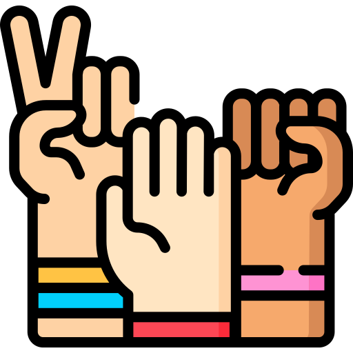

# 🪨📄✂️ **ROCK PAPER SCISSORS**

<div align="center">
  
  
  
  
  
  

  <br>
  
  

  <h3>A modern twist on the classic hand game with smooth animations and real-time scoring</h3>

  <br>

  []()
  []()

</div>

---

## 📋 **TABLE OF CONTENTS**

- [🎮 Game Overview](#-game-overview)
- [✨ Features](#-features)
- [🛠️ Tech Stack](#️-tech-stack)
- [📁 Project Structure](#-project-structure)
- [🚀 How to Play](#-how-to-play)
- [🎯 Game Rules](#-game-rules)
- [📊 Scoring System](#-scoring-system)
- [🎨 Visual Design](#-visual-design)
- [💻 Installation](#-installation)
- [📱 Responsive Design](#-responsive-design)
- [🔧 Code Structure](#-code-structure)
- [🤝 Contributing](#-contributing)
- [📬 Connect](#-connect)
- [📄 License](#-license)

---

## 🎮 **GAME OVERVIEW**

Rock Paper Scissors is a timeless hand game brought to life with modern web technologies. Challenge the computer in this visually stunning, animated version of the classic game. With smooth transitions, real-time score tracking, and an intuitive interface, it's the perfect way to pass the time and test your luck!

> *"The most visually appealing Rock Paper Scissors game you'll play today!"*

---

## ✨ **FEATURES**

<div align="center">

| 🎯 **Core Features** | 🎨 **Visual Features** | ⚡ **Technical Features** |
|:---:|:---:|:---:|
| One-click gameplay | Smooth CSS animations | Zero dependencies |
| Real-time score tracking | Gradient backgrounds | Responsive design |
| Win/Loss/Draw detection | Glowing effects | Cross-browser compatible |
| Game reset functionality | Color-coded selections | Lightweight (~200 lines) |
| Computer AI opponent | Blur glass effects | Fast loading |
| Best of 10 scoring | Hover animations | Mobile optimized |

</div>

### **Detailed Feature List**

| Feature | Description |
|---------|-------------|
| **🎯 One-Click Gameplay** | Make your move with a single click |
| **🤖 Smart Computer Opponent** | Random AI that never cheats |
| **🏆 Score Tracking** | Keep track of wins up to 10 points |
| **🔄 Auto Reset** | Game automatically resets after each round |
| **🎨 Visual Feedback** | Red glow for player, yellow for computer |
| **✨ Smooth Animations** | Buttons pulse and glow with style |
| **📱 Fully Responsive** | Works on desktop, tablet, and mobile |
| **🌀 Gradient Background** | Beautiful cosmic gradient theme |
| **🔲 Glass Morphism** | Modern frosted glass effect on text |

---

## 🛠️ **TECH STACK**

<div align="center">

| Technology | Purpose | Icon |
|------------|---------|------|
| **HTML5** | Structure & Semantics |  |
| **CSS3** | Styling & Animations |  |
| **JavaScript ES6** | Game Logic & Interactions |  |

</div>

---

## 📁 **PROJECT STRUCTURE**

```
📦 ROCK-PAPER-SCISSORS/
├── 📂 IMAGES/
│   ├── 🖼️ Header.png        # Game logo
│   ├── 🖼️ Fist.png          # Rock icon
│   ├── 🖼️ Paper.png         # Paper icon
│   └── 🖼️ Scissors.png      # Scissors icon
├── 📄 ROCK.html             # Main game page
├── 📄 PAPER.css             # All styling
├── 📄 SCISSORS.js           # Game logic
└── 📄 README.md             # You are here!
```

### **File Breakdown**

| File | Size | Purpose |
|:---:|:---:|:---|
| **ROCK.html** | 2.5 KB | Game structure and layout |
| **PAPER.css** | 4.2 KB | Visual design and animations |
| **SCISSORS.js** | 5.1 KB | Game mechanics and logic |
| **Images** | ~50 KB | Game icons and logo |

---

## 🚀 **HOW TO PLAY**

### **Step-by-Step Guide**

1. **Open** the `ROCK.html` file in your browser
2. **Choose** your weapon:
   - 🪨 **Rock** (Fist icon)
   - 📄 **Paper** (Paper icon)
   - ✂️ **Scissors** (Scissors icon)
3. **Watch** as the computer makes its choice
4. **See** the result:
   - 🔴 **Red glow** = Your choice
   - 🟡 **Yellow glow** = Computer's choice
5. **Score** updates automatically
6. **Play again** after auto-reset (2.5 seconds)

### **Controls**

| Control | Action |
|:---:|:---|
| 🖱️ **Click** any button | Make your move |
| 🔄 **Reset button** | Reset scores and game |

---

## 🎯 **GAME RULES**

### **The Classic Rules**

```
🪨 ROCK crushes ✂️ SCISSORS
📄 PAPER covers 🪨 ROCK
✂️ SCISSORS cuts 📄 PAPER
🤝 Same choice = DRAW
```

### **Win Conditions**

| Your Choice | Computer Choice | Result |
|:---:|:---:|:---:|
| Rock (🪨) | Scissors (✂️) | ✅ **YOU WIN!** |
| Paper (📄) | Rock (🪨) | ✅ **YOU WIN!** |
| Scissors (✂️) | Paper (📄) | ✅ **YOU WIN!** |
| Any match | Same as yours | 🤝 **DRAW** |
| Anything else | Anything else | ❌ **COMPUTER WINS** |

### **Scoring**
- First to **10 points** wins the match
- Scores persist until reset
- Reset button clears all scores

---

## 📊 **SCORING SYSTEM**

The game features a best-of-10 scoring system:

```javascript
// Score tracking
let userScore = 0;
let computerScore = 0;

// Win conditions
if (playerWins) {
    userScore++;
} else if (computerWins) {
    computerScore++;
} // Draw = no score change

// Game ends when someone reaches 10
if (userScore >= 10 || computerScore >= 10) {
    // Champion is crowned!
}
```

---

## 🎨 **VISUAL DESIGN**

### **Color Palette**

| Element | Color | Hex Code |
|:---:|:---:|:---:|
| **Background** | Cosmic Gradient | `#153e56 → #0e6f8d → #370869` |
| **Player Highlight** | Red | `rgba(209, 12, 12, 0.826)` |
| **Computer Highlight** | Yellow | `rgba(209, 209, 12, 0.826)` |
| **Default Border** | Green | `#0fd81d` |
| **Text Background** | Glass White | `rgba(255, 255, 255, 0.2)` |

### **Animations**

```css
@keyframes hoverEffect {
    0% { transform: translateY(-1px); box-shadow: 0 0 2vmin rgba(255,255,255,0.5); }
    50% { transform: translateY(-2px); box-shadow: 0 0 5vmin rgba(255,255,255,0.5); }
    100% { transform: translateY(0px); box-shadow: 0 0 0vmin rgba(255,255,255,0.5); }
}
```

### **Glass Morphism Effect**
```css
.glass-effect {
    background: rgba(255, 255, 255, 0.2);
    backdrop-filter: blur(10px);
    border-radius: 1.5rem;
    border: 1px solid rgba(255, 255, 255, 0.3);
}
```

---

## 💻 **INSTALLATION**

### **Option 1: Direct Download**

```bash
# Clone the repository
git clone https://github.com/yourusername/rock-paper-scissors.git

# Navigate to project folder
cd rock-paper-scissors

# Open in browser
open ROCK.html  # Mac
start ROCK.html # Windows
```

### **Option 2: VS Code Live Server**

```bash
# Install Live Server extension
# Right-click ROCK.html
# Select "Open with Live Server"
```

### **Option 3: Manual Setup**

1. Download all files and folders
2. Maintain the exact structure:
   ```
   your-folder/
   ├── IMAGES/
   │   ├── Header.png
   │   ├── Fist.png
   │   ├── Paper.png
   │   └── Scissors.png
   ├── ROCK.html
   ├── PAPER.css
   └── SCISSORS.js
   ```
3. Double-click `ROCK.html`

---

## 📱 **RESPONSIVE DESIGN**

The game adapts seamlessly to all screen sizes:

| Device | Experience |
|:---:|:---|
| **Desktop (1920px+)** | Full layout with optimal spacing |
| **Laptop (1366px)** | Comfortable button sizes |
| **Tablet (768px)** | Buttons wrap gracefully |
| **Mobile (375px)** | Compact but playable |

**Key responsive features:**
- Fluid typography with `vmin` and `vmax` units
- Flexbox wrapping for buttons
- Percentage-based sizing
- Media query ready structure

---

## 🔧 **CODE STRUCTURE**

### **JavaScript Logic Flow**

```
┌─────────────────┐
│  User Clicks    │
│     Button      │
└────────┬────────┘
         ▼
┌─────────────────┐
│  Record Choice  │
│  Apply Red Glow │
└────────┬────────┘
         ▼
┌─────────────────┐
│  Computer Turn  │
│  (1s delay)     │
└────────┬────────┘
         ▼
┌─────────────────┐
│  Apply Yellow   │
│     Glow        │
└────────┬────────┘
         ▼
┌─────────────────┐
│  Determine      │
│  Winner         │
└────────┬────────┘
         ▼
┌─────────────────┐
│  Update Score   │
│  Show Result    │
└────────┬────────┘
         ▼
┌─────────────────┐
│  Auto Reset     │
│  (2.5s delay)   │
└─────────────────┘
```

### **Key Functions**

| Function | Purpose |
|----------|---------|
| `comp(prop)` | Computer's move logic |
| `winner(rando)` | Determines round winner |
| `compScore()` | Updates and displays scores |
| `reset()` | Resets game state |
| `color(bond)` | Removes animation classes |

---

## 🤝 **CONTRIBUTING**

Contributions are welcome! Here's how:

1. **Fork** the repository
2. **Create** a feature branch
   ```bash
   git checkout -b feature/AmazingFeature
   ```
3. **Commit** your changes
   ```bash
   git commit -m 'Add AmazingFeature'
   ```
4. **Push** to the branch
   ```bash
   git push origin feature/AmazingFeature
   ```
5. **Open** a Pull Request

### **Guidelines**
- Keep code clean and commented
- Test thoroughly before submitting
- Follow existing code style
- Update documentation as needed

---

## 📬 **CONNECT**

<div align="center">

### **Ehtisham Ul Haq**

[](https://github.com/yourusername)
[](www.linkedin.com/in/ehtisham-ul-haq-44191b340)
[](mailto:the.prince.ehtisham@gmail.com)

**📧 the.prince.ehtisham@gmail.com**  
**💼 www.linkedin.com/in/ehtisham-ul-haq-44191b340**

</div>

---

## 📄 **LICENSE**

This project is open source and available under the **MIT License**.

```
MIT License

Copyright (c) 2025 Ehtisham Ul Haq

Permission is hereby granted, free of charge, to any person obtaining a copy
of this software and associated documentation files...
```

---

## 🙏 **ACKNOWLEDGMENTS**

- Inspired by the classic hand game we all love
- Built with passion and JavaScript
- Special thanks to the open-source community

---

## 🎉 **THANK YOU!**

<div align="center">

### ⭐ **If you like this project, give it a star!** ⭐

<br>

| [🎮 Play Game](#) | [🐛 Report Bug](https://github.com/yourusername/rock-paper-scissors/issues) | [✨ Request Feature](https://github.com/yourusername/rock-paper-scissors/issues) |
|:---:|:---:|:---:|

<br>
<br>

**Made with ❤️, ☕, and JavaScript by Ehtisham Ul Haq**

**Last Updated: March 2025**


</div>